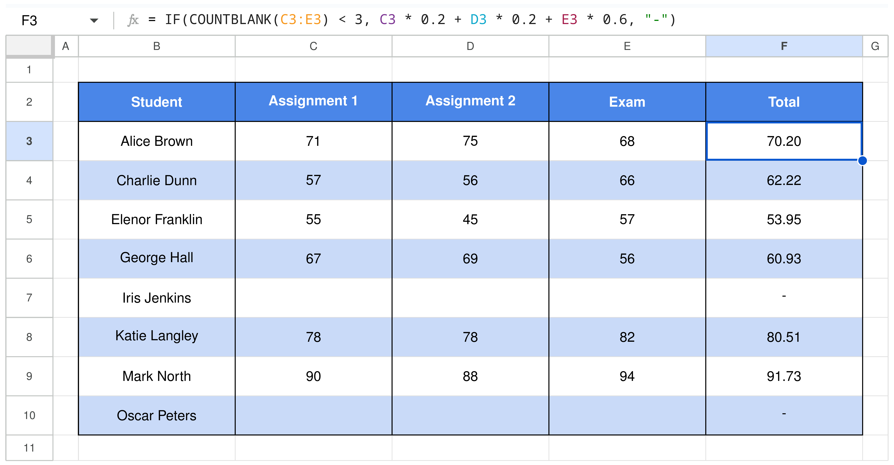

# `latexcel`

`latexcel` is a $\LaTeX{}$ package which provides an environment for imitating the interface of Google Sheets or Excel (or other spreadsheet software) in $\LaTeX{}$. It relies on the `xcolor`, `tikz`, and `environ` packages, and uses LaTeX3 syntax.

## Examples

See the documentation for a full list of options and examples. Some examples are shown below.

### Example Styling

The example below shows a sample used to illustrate the calculation of a weighted grade for students. No additional styling has been applied outside of what is shown, except for the choice of font (Helvetica for text, and Noto Mono for monospaced text).

```latex
\begin{latexcel}[
    header row color    = SheetsCornflowerBlue,
    odd row color       = SheetsLightCornflowerBlue3,
    header cell style   = {\color{white}\bfseries}, 
    formula             = {IF(COUNTBLANK(C3:E3) < 3, C3 * 0.2 + D3 * 0.2 + E3 * 0.6, "-")},
    selected cell       = {5, 2}
]
    Student         & Assignment 1  & Assignment 2  & Exam  & Total \\
    Alice Brown     & 71            & 75            & 68    & 70.20 \\
    Charlie Dunn    & 57            & 56            & 66    & 62.22 \\
    Elenor Franklin & 55            & 45            & 57    & 53.95 \\
    George Hall     & 67            & 69            & 56    & 60.93 \\
    Iris Jenkins    &               &               &       & -     \\
    Katie Langley   & 78            & 78            & 82    & 80.51 \\
    Mark North      & 90            & 88            & 94    & 91.73 \\
    Oscar Peters    &               &               &       & - 
\end{latexcel}
```

[](./examples/example-1.png)